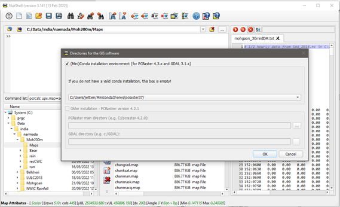

A more extensive guide to using OpenLISEM, and detailed explanation of all parts of the model can be found in the [manual](../using-openlisem/manual/index.md). Throughout the quick start we link to sections of the manual were applicable. 

## Setup & Installation

**NOTE: this setup works for windows systems, for linux systems users are referred to the manual**

To use OpenLISEM, the model has to be installed on your system, and some other software is required for a full use of the model. The OpenLISEM model is available as an executable program for Windows (64-bit), and can be [compiled]() both under Windows and Linux systems. The OpenLISEM model uses the [PCRaster](https://pcraster.geo.uu.nl/) GIS environment for input and output maps. To work with PCRaster a user interface, Nutshell, is available. The easiest way to use PCRaster is by installing it through a conda environment on your system. Besides this minimal installation, a dedicated GIS program is usefull for database preparation, for example the opensource [QGIS](https://qgis.org/en/site/).

Follow the steps below to setup your PC:

1. Install miniconda
1. Install PCRaster software with miniconda
1. download and install OpenLISEM & Nutshell

### 1. Install miniconda

> 🚧 change description to installation of miniforge3 and mamba?. The approach with miniconda also works

***

The PCRaster software we use is installed in **Conda**. Conda is an installation environment independent of programming language and platform (windows, unix). On Windows machines, first download and install the "minimal conda environment" **miniconda**.

[Download](https://docs.conda.io/en/latest/miniconda.html) and install the latest 64bit version.

Anaconda/miniconda is a repository that works with so called 'environments'. These are separated folders under which you can install programs and libraries. Each environment is independent from other environments, if something goes wrong you can delete the entire environment without damaging other installs. We will create an environment called “lisem” and install everything in there.  To open miniconda go to your program list and look under ’A’ for Anaconda3 (64-bit) and under that folder click on Anaconda Prompt (miniconda3). 

This opens a command window. Note that the prompt says: 

> `(base) PS C:\path\to\username>`

Now miniconda is installed, we can proceed by installing PCRaster in a separate environment.

### 2. Install PCRaster with miniconda

In the miniconda shell, we are now in the 'base' environment. For OpenLISEM we want to create a new environment, we suggest to call this 'lisem'.

> `conda create --name lisem`

Now activate the 'lisem' environment. Whatever you install now will be done in this workspace/environment. In that way you can separate different projects:

> `conda activate lisem`

Install the following packages (answer “y” to prompts):

> `conda install -c conda-forge pcraster gdal`

This takes a while, but this should be all. Check if it worked:  

> `pcrcalc`

Should return a help syntax.

### 3. Download and install OpenLISEM & Nutshell

Download the latest release for [OpenLISEM](https://github.com/vjetten/openlisem/releases/). This is an installer file. Double click the installer and follow the instructions. This will install OpenLISEM to your available software. 

PCRaster does not have a menu or interface, it can be operated from the command line. A user interface was created separately and is called [Nutshell](https://github.com/vjetten/NutShell/releases/tag/NutShell). This software is standard provide with the OpenLISEM installation. And after installing OpenLISEM, Nutshell will also be available on your device. To check if everything works, open Nutshell and write the following command in the upper left console and hit 'enter':

> `pcrcalc`

This should again show the help syntax. PCRaster and NutShell are now ready for use! An introduction to using PCRaster and Nutshell can be found [here](../using-openlisem/manual/Introduction-PCRaster-&-Nutshell.md).

  

