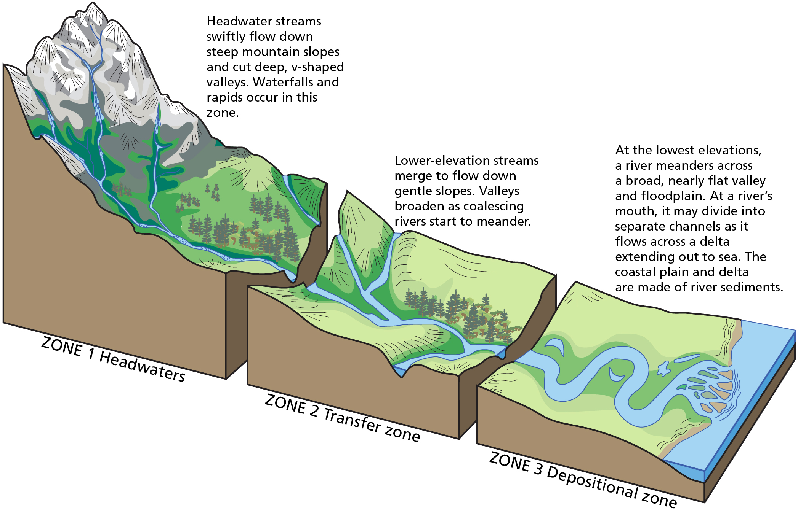
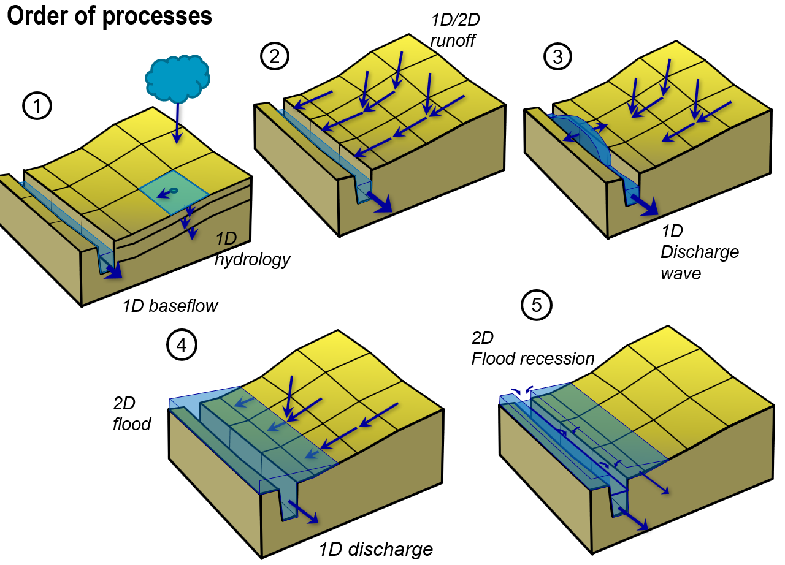
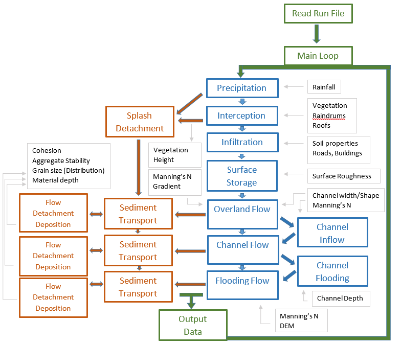

OpenLISEM is a further development of the original LISEM model, which was released in 1993, it has a rich [history](../about-openlisem/History.md) of developments and applications worldwide. The model is designed to simulate runoff and related sediment dynamics in the headwaters and transfer zones of a catchment (see figure below), the model does not perform well when simulating large meandering river systems and deltas, this is mainly because river hydraulics are to simplistic in OpenLISEM.

  

_source: Trista L. Thornberry-Ehrlich, Colorado State University._

OpenLISEM simulates the surface water balance to determine the amount of runoff, the runoff flows to the river system, which can overflow to cause a flood. For these processes also sediment dynamics can be simulated.

## Order of processes in OpenLISEM

When we simulate a rainfall event with OpenLISEM the order of events can be divided into 5 steps (see figure below).
1. When the precipitation starts, hydrology processes within the cell are modeled, these include infiltration, interception and ponding. If a channel with base flow exist in the catchment, this is also modeled.
1. When the precipitation exceeds the infiltration potential in the catchment, overland flow will start, this is routed either by 1D or 2D flow solutions over the surface towards the channel system. The flow is influenced by surface characteristics (vegetation type, stonefraction etc) and landscape elements (roads, buildings or conservation measures).
1. When the water arrives in the channel, a 1D kinamatic discharge wave will flow through the channel system towards the outlet.
1. If more discharge occurs than the channel system can handle, flooding occurs.
1. When the precipitation stops and discharge volumes decrease the flood recedes and the flooding water drains into the channel system.

  

To simulate all these processes OpenLISEM makes use of an input [map database](https://github.com/vjetten/openlisem/wiki/Prepare-Data) and a runfile containing all choices on options of the model run. The figure below shows the layout of the model, with all steps performed during a model run. If you want to use OpenLISEM yourself, we refer to the [quick start](../quick-start/Getting-started.md).

  

