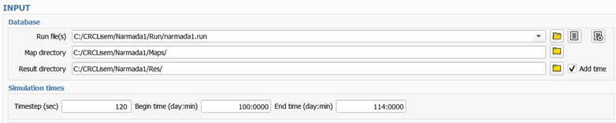
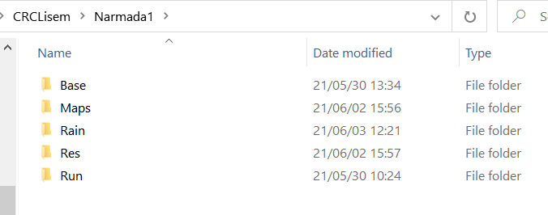

  

## Database folders
Conventionally, openLISEM has 4 folders for a model run: the ‘run’ folder that contains all run files for different scenarios, a ‘maps’ folder that contains all input maps and tables, a ‘rain’ folder that contains all meteorological input, and a ‘res’ folder in which results are stored. You can give your own names. Often it is convenient to have a 5th folder called 'base' where base maps are stored that are not directly used by openLISEM.

  

The run file is a text file that can be generated simply by pressing the save file button in the top bar. It contains all options in the interface and all standard input and output file names. You can make a run file per run/scenario/project. It can be edited by hand but it is not guaranteed that openLISEM can read your edited options. Run files will be stored and become available in a drop down list.
If you select “add time” a subfolder with a timestamp will be created each time you press the run button to separate the results of each run (careful, this can easily take up a lot of space). 

## Simulation times
The **timestep** is given in seconds, rule of thumb is to let the timestep in seconds not be more than twice the gridcell size in meters. Choose a timestep by trial and error. The timestep will influence the results because of averaging over larger timesteps, especially when using a kinematic wave for flow.  
Note that the hydrological processes and kinematic wave flow are executed with this timestep, while the 2D flow has its own internal timestep, that is adapted to the needs of the numerical solution.
Depending on the choice of flow equations the timestep for the 2D flow will be a fraction of this timestep.  
**Begin and end time**: given in day numbers and minute numbers (ddd:mmmm) from 1-366 and 0-1440. The meteorological input follows the same format. Note that the timespan in the meteo input should cover the begin and end time of the interface.

