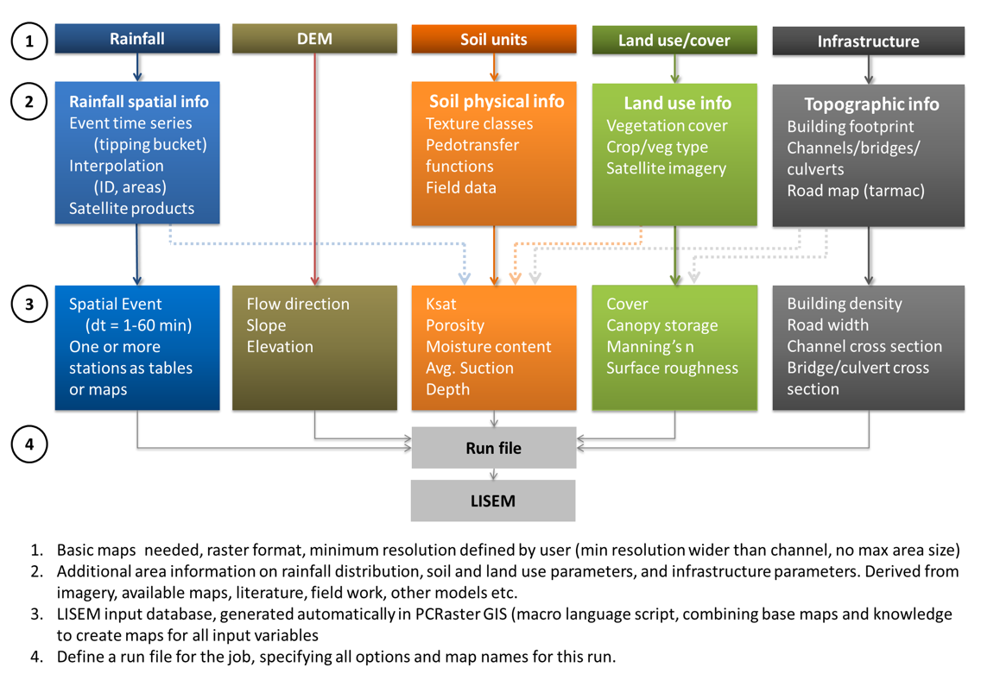

Within this section, the preparation for all input data categories will be described. OpenLISEM needs a minimum of 24 maps depending on the input options selected in the interface such as special surfaces, sediment modelling, and 2-layer sediment transport in channels. The input maps can be made with any GIS program. Since openLISEM is integrated with PCRaster, we suggest the use of this GIS to prepare maps.

Here you can find a short introduction to [PCRaster & Nutshell](../Introduction-PCRaster-&-Nutshell.md)

The sections below describe the preparation by using PCRaster, and give suggestions for data sources etc.
1. [Rainfall](./Prepare-Rainfall.md)
1. [Catchment](./Preparing-Topography.md)
1. [Land use](./Prepare-Land-Use.md)
1. [Soil properties & Infiltration](./Prepare-Soil-Properties.md)
1. [Channels](./Prepare-Channels.md)
1. [Infrastructure](./Prepare-Infrastructure.md)  

Most sources of data such as remote sensing, and public databases in both vector and raster form, can
be transformed to usable input for the OpenLISEM model. The figure below show the data structure and how input and data sources are related.

  

